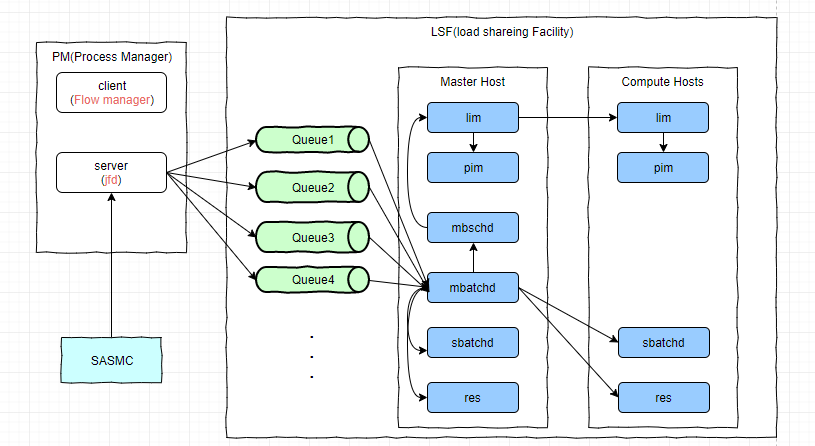
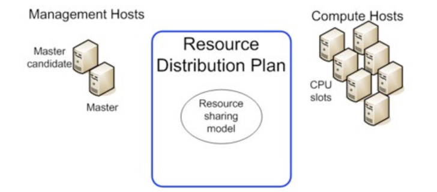
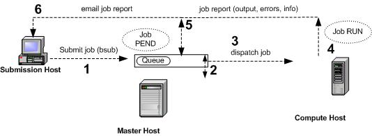
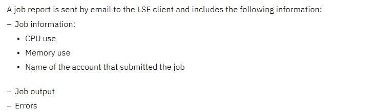

# 1 命令

1. 查看句柄 `lsof -n|awk '{print $2}'|sort|uniq -c|sort -nr|more`
2. 抓包

```bash
$ tcpdump -i eth0 -s0 -n -vvv host 10.27.72.248 -w -|strings |grep -A 6 "POST /RTDM/rest/runtime/decisions/HCP_Trans_Notification" |grep X-Forwarded-For

$ tcpdump -i eth0 --immediate-mode  host 10.27.72.248 -w -|strings |awk -F ",|:" '/sendTime.*hcp/{print "decision id is :",$4,"sendTime is :",$8,"sysdate is :",systime(),"delay time:",systime()-$8}' >> 

# 格式化时间
$ cat rtdm_sendtime_recivetime.log |awk '$NF>15{print $3,$4,strftime("%Y-%m-%d %H:%M:%S",$5),$6,strftime("%Y-%m-%d %H:%M:%S",$7),$8,$9,$10}'

# 抓包
$ tcpdump -i any host 10.27.72.248 -tttt --immediate-mode -C 100 -Z root -W 100 -A -w HCIProxy_to_RTDM.txt

# 看包
$ tcpdump -r HCIProxy_to_RTDM.txt36 -vvv -s0 -w -|strings >>222.txt

指定抓包文件数
$ tcpdump -i any  -tt -nn -A |grep -A10 -i  sendtime
$ tcpdump -i eth0 host 10.27.72.248 and port 80 -tt --immediate-mode -C 100 -Z root -W 10 -w eventHub_rtdm.pcap
$ tcpdump -i eth0 host 10.27.72.248 and port 80 -nn -tttt --immediate-mode -A >111.txt
```

3. 接口耗时分析

```bash
# 过滤耗时大于5s的flow
$ awk -F"[|]|took|nanos" '{if ($(NF-1)/1000000000 > 5) printf "%-25s |%-40s|%-65s |%3.3f\n",$1,$2,$4,$(NF-1)/1000000000"s"}'  DSPerf-sasprod-crmrweb0?.cn.prod.log 

# 过滤大于5s的flow后，按decision id去重，并去耗时最大的flow (可以过滤出decision_id)
$ awk -F"[|]|took|nanos" '{if ($(NF-1)/1000000000 > 5) printf "%-25s |%-40s|%-65s |%3.3f\n",$1,$2,$4,$(NF-1)/1000000000"s"}'  DSPerf-sasprod-crmrweb02.cn.prod.log  |sort -t '|' -k4 -nr |awk -F'|' '!a[$3]++' >1.txt

# 通过上一步找到每类flow，最耗时的decision_id，计算其对应整个决策流的总时长
$ for i in `cat 1.txt`;do eval sed -n '/$i/p' DSPerf-sasprod-crmrweb02.cn.prod.log |awk -F"[|]|took|nanos" '{sum+=$(NF-1)} END {print $2,"Total cost: ", sum/1000000000"s"}';done

# 查看每一步的耗时和总耗时
$ for i in `cat 1.txt`;do eval sed -n '/$i/p' DSPerf-sasprod-crmrweb02.cn.prod.log |awk -F"[|]|took|nanos" 'BEGIN{printf "%-25s |%-40s|%-65s |%3.3f\n","time","decision_id","Flow/Activity name","cost(s)"}{sum+=$(NF-1);printf "%-25s |%-40s|%-65s |%3.3f\n",$1,$2,$4,$(NF-1)/1000000000"s"}END{printf "%-25s |%-39s |%65s |%3.3f\n","","","Total cost:",sum/1000000000"s"}';done

# 查看某个decision 的总决策时间
$ awk -F"[|]|took|nanos" '/abf8e21e-151d-40a4-afa3-b311a349e45a/{sum+=$(NF-1)} END {print $2,"Total cost: ", sum/1000000000"s"}' DSPerf-sasprod-crmrweb02.cn.prod.log

# 查看某个decision 每个步骤的决策时间
$ awk -F"[|]|took|nanos" '/cde302ed-4d72-443a-b3a9-eff8ee55be8c/{printf "%-25s |%-40s|%-65s |%3.3f\n",$1,$2,$4,$(NF-1)/1000000000"s"}'  DSPerf-sasprod-crmrweb02.cn.prod.log 


# 统计每个flow的调用次数
$ awk -F"[|]|took|nanos" '/2021-04-08 16.*Flow/{++aa[$4]}END{for(i in aa) printf "%-80s|%-10s\n",i,aa[i]}'  DSPerf-sasprod-crmrweb02.cn.prod.log |sort -k1

# 查看某个decision id 对应的每个步骤
$ grep "a33302d7-cd8e-4546-bc9d-59b6885db28f" DSPerf-sasprod-crmrweb02.cn.prod.log |awk -F"[|]|took|nanos" '{print $(NF-2)}'  |tr -d " ." |uniq


$ dt="2021-04-08 17:49";sed -n "/$dt/p" DSPerf-sastest-crmrweb01.cn.infra.log |awk -F"[|]|took|nanos" '{++aa[$4]}END{for(i in aa) printf "%-80s|%-10s\n",i,aa[i]}' 


# 统计每个flow 的调用次数
$ cat DSPerf-sasprod-crmrweb0?.cn.prod.log.2021-05-10 |awk -F"[|]|took|nanos" '{++aa[$4]}END{for(i in aa) printf "%-80s|%-10s\n",i,aa[i]}' |sort -t "|" -n -k2 |awk -F "|" '{print $0;sum+=$(NF)}END{print "sum count:",sum}'
```

4. ELK搜索语法

```bash
1、要搜索一个确切的字符串，即精确搜索，需要使用双引号引起来：path:”/app/logs/nginx/access.log”
2、如果不带引号，将会匹配每个单词：uid token
3、模糊搜索：path:”/app/~
4、* 匹配0到多个字符：*oken
5、? 匹配单个字符 : tok?n
6、+：搜索结果中必须包含此项 -：不能含有此项 什么都没有则可有可无： +token -appVersion appCode
7、运算符AND/OR/NOT必须大写：token AND uid ；token OR uid；NOT uid
8、允许一个字段值在某个区间（[] 包含该值，{}不包含）：@version:[1 TO 3]
9、组合查询：(uid OR token) AND version
10、转义特殊字符 + – && || ! ( ) { } [ ] ^ ” ~ * ? : \ 转义特殊字符只需在字符前加上符号\
11、分组(firstname:H* OR age:20) AND state:KS 先查询名字H开头年龄或者是20的结果，然后再与国家是KS的结合
12、firstname:(+H* -He*) 搜索firstname字段里H开头的结果，并且排除firstname里He开头的结果
```

5. alias

```bash
# cat .collin 
if [ -d /opt/sas ]; then
	sashome=/opt/sas
	alias perf='cd /opt/share/logs/rtdm/perf'
	alias job='cd /opt/tmp/ma/Sync_and_Purge/Deployed_Jobs'
else
	sashome=/opt
	alias perf='cd /opt/config/Lev1/Web/Logs/SASServer7_1/perf'
	alias job='cd /opt/ma/Sync_and_Purge/Deployed_Jobs'
fi

export PS1='\[\e[34;1m\][\u@\h:\w]# \[\e[0m\]'
export ORACLE_HOME=$sashome/oracle/product/12.1.0/client_2
export PATH=./:$ORACLE_HOME/bin:$PATH

# path
alias backup='cd /opt/tmp/backup'
alias macro='cd $sashome/config/Lev1/SASApp/SASEnvironment/SASMacro'
alias stp='cd $sashome/config/Lev1/SASApp/SASEnvironment/SASCode/Stp'
alias tns='cd $sashome/oracle/product/12.1.0/client_1/network/admin'
alias SAS='cd $sashome/SAS'
alias import='cd $sashome/SAS/SASPlatformObjectFramework/9.4'
alias util='cd $sashome/SAS/SASCustomerIntelligenceUtilities/6.6'
alias license='cd $sashome/SAS/licenses'

#logs
alias httpdlog='cd /opt/sas/config/Lev1/Web/WebServer/logs'

#cmd
alias dug='du --block-size=G --max-depth=1 2>/dev/null | sort -nr'
alias ll='ls -rtl --color=auto'
alias lld='ls -rtl --color=auto | grep ^d'
alias lla='l. -rtl --color=auto'
alias lsf='ps -fu lsfadmin,root | egrep "[j]fd|[l]im|[p]im|[p]em|[v]emkd|[r]es|[s]batchd|[m]batchd|[m]bschd|[e]gosc"'
alias sas.servers='$sashome/config/Lev1/sas.servers'
```


# 2 脚本

1. Monitor the status of the SAS Server

```bash
# cat /home/sas/scripts/sas_status_monitoring/sas_status_monitoring
#!/bin/bash

# description: Monitor the status of the SAS Server

metric_file="/opt/node_exporter/metrics/sasmetrics.prom"
hostname=`hostname`
ipaddr=`hostname -i`
prod="rtdm"
tier='app'
app="rtdm01"
metric_name="sasserver_status"
service_down_count=`/opt/sas/config/Lev1/sas.servers status |grep -i "not up" |wc -l`

if [ -f $metric_file ];then
    metric_exist=`grep $metric_name $metric_file |wc -l`
    if [ $metric_exist -ge 1 ];then
        sed -i "/$metric_name/d" $metric_file
        echo "${metric_name}{label=\"${metric_name}\",prod=\"${prod}\",tier=\"${tier}\",hostname=\"${hostname}\",app=\"${app}\"} ${service_down_count}" >> $metric_file
    else
        echo "${metric_name}{label=\"${metric_name}\",prod=\"${prod}\",tier=\"${tier}\",hostname=\"${hostname}\",app=\"${app}\"} ${service_down_count}" >> $metric_file
    fi
else
    echo "${metric_name}{label=\"${metric_name}\",prod=\"${prod}\",tier=\"${tier}\",hostname=\"${hostname}\",app=\"${app}\"} ${service_down_count}" >> $metric_file
fi


# description: Monitor the apached response code

logdir=/opt/sas/config/Lev1/Web/WebServer/logs/
logfile=`cd $logdir;ls -lrt access_*|tail -n 1 |awk '{print $NF}'`
error_count=`awk '$6 ~ /POST/ && $9 == 404 || $9 == 500{print $0}' ${logdir}/${logfile} |wc -l`

metric2="rtdm01_error_count"
if [ -f $metric_file ];then
    metric_exist=`grep $metric2 $metric_file |wc -l`
    if [ $metric_exist -ge 1 ];then
        sed -i "/$metric2/d" $metric_file
    	echo "${metric2}{label=\"${metric2}\",app=\"${app}\"} ${error_count}" >> $metric_file
    else
    	echo "${metric2}{label=\"${metric2}\",app=\"${app}\"} ${error_count}" >> $metric_file
    fi
else
    	echo "${metric2}{label=\"${metric2}\",app=\"${app}\"} ${error_count}" >> $metric_file
fi
```

2. 监控oracle数据库业务表

```bash
# cat /home/sas/scripts/sas_rtdm_errorlog_monitoring/monitor_rtdm_errorlog.sh
#!/bin/sh

promfile=/opt/node_exporter/metrics/rtdm_errorlog.prom
codetempfile=/home/sas/scripts/sas_rtdm_errorlog_monitoring/errorByCode
campaigntempfile=/home/sas/scripts/sas_rtdm_errorlog_monitoring/errorByCampaign

TNS="APP_RTCDM/AQmA9zpc3Y8m6Qh@DBSASSRCN.CN.PROD:1521/SASSRCN.HOMECREDIT.CN"
SQL01="SELECT ERROR_CODE ||'|'|| count(1) VALUE FROM APP_RTCDM.CIE_RTDM_ERROR_LOG CREL WHERE ERROR_DT > SYSDATE - 5/1440 GROUP BY ERROR_CODE;"
SQL02="SELECT RTDM_FLOW_NAME ||'|'|| count(1) VALUE FROM APP_RTCDM.CIE_RTDM_ERROR_LOG CREL WHERE ERROR_DT > SYSDATE - 5/1440 GROUP BY RTDM_FLOW_NAME;"
execute_sql(){
sqlplus -S "$TNS" <<EOF
set heading off
set term off
set termout off
set feedback off
set pagesize 0
set verify off
set echo off
spool $codetempfile
$SQL01
spool off
spool $campaigntempfile
$SQL02
spool off
exit;
EOF
}

clear_prom(){
  cat /dev/null > $promfile
}

generate_prom01(){
sed -i 's/ //g' ${codetempfile}.lst
while read line
do
  echo $line |awk -F "|" '{print $1,$2}' |while read code value
  do
  echo "rtdmErrorByCode{code=\"${code}\",app=\"rtdm\"} ${value}" >> $promfile
  done
done < ${codetempfile}.lst
}

generate_prom02(){
sed -i 's/ //g' ${campaigntempfile}.lst
while read line
do
  echo $line |awk -F "|" '{print $1,$2}' |while read flowName value
  do
  echo "rtdmErrorByCampaign{flowName=\"${flowName}\",app=\"rtdm\"} ${value}" >> $promfile
  done
done < ${campaigntempfile}.lst
}


main(){
    execute_sql
    clear_prom
    generate_prom01
    generate_prom02
}

main
```

3. 流量监控

```bash
# cat /home/sas/scripts/sas_DBPerflog_monitoring/flow_traffic_monitor.sh
#!/bin/bash

#################################################################################################################
# 2021-04-09          collin                     First version   v0.1  add "count and avg cost time"            # 
# 2021-04-18          collin                     Second version  v0.2  add "max cost time"                      #
#												                #
#												                #	
#												                #		
#################################################################################################################

# DESCRIPTION
# This script reads the DBPerf log, calculates the count of flow/activity executions per minute
# and the average elapsed time,and the max cost time.
# converts the results to PROM format, and sends them to NODE_EXPORTOR#


logfile="/opt/share/logs/rtdm/perf/DSPerf-sasprod-crmrweb01.cn.prod.log /opt/share/logs/rtdm/perf/DSPerf-sasprod-crmrweb02.cn.prod.log"
#dt=`date -d "1 minute ago" +"%Y-%m-%d %H:%M"`
time=`date -d "10 minute ago" +"%Y-%m-%d %H:%M"`
dt=`echo ${time:0:15}`
promfile=/opt/node_exporter/metrics/DBPerf.prom
hostname=`hostname`
tmpfile=/home/sas/scripts/sas_DBPerflog_monitoring/tmp.file

# clear the prom file
cat /dev/null > $promfile


# Generate a temporary file for the last minute log
for log in $logfile
do
    # The last result needs to be cleared before each run
    cat /dev/null > $tmpfile
    sed -n "/$dt/p" $log|tr -d " ." >> $tmpfile
    sed  -i -r 's/\_[0-9]\_[A-Z0-9]{16}//g' $tmpfile
    app=`echo $log |grep -Eo "web01|web02"`
    
    # Calculate count ,average cost time and max cost time of flow/activity execute
    awk -F"[|]|took|nanos" -v hostname=$hostname -v promfile=$promfile  -v app=$app\
    '{flowname[$4]++;sumcost[$4]+=($5/1000000);maxcost[$4]=($5/1000000>maxcost[$4]?int($5/1000000):maxcost[$4])}
        END{
            for (name in flowname){
                print name"{hostname=\""hostname"\"," "flowname=\""name"\"," "app=\""app"\",type=\"count\"}",flowname[name] >> promfile;
                print name"{hostname=\""hostname"\"," "flowname=\""name"\"," "app=\""app"\",type=\"avgcost\"}",int(sumcost[name]/flowname[name]) >> promfile;
                print name"{hostname=\""hostname"\"," "flowname=\""name"\"," "app=\""app"\",type=\"maxcost\"}",maxcost[name] >> promfile
            }
    };' ${tmpfile}
done
```

4. 日志清理

```bash
# cat /home/sas/scripts/sas_log_arch-del/sas_log_arch-del.sh
#!/bin/sh

#purge files under path listed in logfiles
logfiles=~/scripts/sas_log_arch-del/logfiles

for line in `cat $logfiles | grep -v ^#`; do
	logpath=`echo $line | awk -F: '{print $1}'`
	gzdays=`echo $line | awk -F: '{print $2}'`
	rmdays=`echo $line | awk -F: '{print $3}'`
	find $logpath -mtime +$gzdays -not -iname "*.gz" -exec gzip {} \;
	find $logpath -mtime +$rmdays -exec rm -rf {} \;
done

# cat ~/scripts/sas_log_arch-del/logfiles
#############################################
#log files that to be purged, use "#" to comment out
#		<log path>:<days to gzip>:<days to delete>
#############################################
/opt/sas/config/Lev1/Web/Logs/SASServer7_1:7:30
/opt/sas/config/Lev1/Web/WebServer/logs/*log*:7:30
/opt/sas/config/Lev1/Web/WebAppServer/*/logs/*log*:7:30
/opt/share/logs/rtdm/perf:7:30
/opt/log/etl_monitor:7:30
```

# 3 英语

## 3.1 SAS migration - progress and risk

```
Progress
Currently servers in WH are ready with the equivalent resources as PROD env., but privilege has not been grant to us due to security consideration. 
Once we got access, we plan to deploy UAT env. manually to validate below items:
•	RTP of SAS manual deployment
•	Communication between SAS and upstream/downstream systems

Risk
Risk is high if migration is done by local team:
•	SAS migration knowledge was not covered during HCI handover sessions last year
•	PROD will go first before DEV/UAT according to current plan

Suggestion
•	Vendor to implement PROD migration and provide training to local team, and then local team implement DEV/UAT migration
•	Vendor provide full support to local team to accomplish SAS migration. We have listed some questions based on existing RTP and request Ales Vychodil’s feedback.

```

| Questions                                                    | comment |
| ------------------------------------------------------------ | ------- |
| We may have 2 ways to do SAS       migration:     a.     Full system copy - it would take ~ 2 days as  estimated by architect. The advantage is  that it will not miss any configuration and file, but question is how to synchronize incremental data?   b.     Manually redeploy SAS - what configuration needs  to be done for OS level? e.g. necessary  accounts, parameter optimization, other pre-deployment  configuration, etc.  What data (directories or files) need to be migrated to  the new server?   If server host name changes, what adjustments need to be  made? |         |

## 3.2 sign off

Kindly check with team for the TC completeness status and provide your sign-off by tomorrow.

Thanks all for your efforts.

1. [TCN-103182](https://jira.homecredit.net/jira/browse/TCN-103182) has been created for UAT R11 (08/Sep/21 - 28/Sep/21).
2. Please check below test cases and let me know if you have any update.


Please review and then we can discuss with business for a final solution.

Duplicate decision occurred yesterday just during homer release, flows flush in while system just startup.

We can regard it as a special case and it should be fine now.

We can start our R9 regression today. Duration is from 14/Jul/21 to 03/Aug/21.

Feel free to let me know if you met any problem. 

We can start our R9 regression today. Duration is from 14/Jul/21 to 03/Aug/21.

Feel free to let me know if you met any problem. 

Thanks for your support, I can enable the TRACE log successfully with loggers.jsp you provided. 

Issue re-occurred today at 8:14 and 8:38 and I collected log as attached.

Thanks for your support, I can enable the TRACE log successfully with loggers.jsp you provided. 

Issue re-occurred today at 8:14 and 8:38 and I collected log as attached.

Thanks for your support, I can enable the TRACE log successfully with loggers.jsp you provided. 

Issue re-occurred today at 8:14 and 8:38 and I collected log as attached.

Please check required logs/resources attached.

We also checked with DBA and no performance issue found from DB side.


Dear SAS support,

 

We observed one issue on our RTDM web server that below system flow/activities occasionally take too much time during RTDM flow execution. 

_SAS_DTUPDATE_DS2_ACTIVITY

_SAS_CHUPDATE_DS2_ACTIVITY

_SAS_CONTACT_HISTORY_DS2_FLOW 

Take decision_id d750b02b-69bb-40ea-b7fe-190935b26d58 for example:

From perf log, we can see those 3 activities/flow cost nearly 10s, which lead to the main flow timeout and repetitive decision triggered. 

Specially, this problem only happens on one server (web04) of rtdm02 link. 

Appreciate your help and advice for the probable reason and resolution. 

Please be noted that campaign has been re-deployed successfully.


Dear SAS support,

 

We are facing a problem and seeking for your kindly help - Excessive tmp files are consuming too much disk on our SAS MA servers as shown in below screenshot. 

(Version=9.4  

Site name: 'HOME CREDIT CONS. FIN. CHINA/CM,RTDM PROD SOE1' 

Site number: 70164670) 


We checked SAS Problem Note 60719: https://support.sas.com/kb/60/719.html, it seems that we **must** stop all services before deleting those files.

Is it necessary? Can we just remove the old files (e.g. >30 days) without stopping services?

 

Besides, as described in 60719, this problem should have been fixed in SAS 9.4M4, but why we are still seeing the issue in version 9.4M6? 

Looking forward to your advice and thanks a lot for your help.


Kindly be informed that R02 has been deployed to PROD design server, you may start your smoke testing.

 We will re-deploy IB_HungUp on runtime server tonight.


Hi Martin,

We got an issue in UAT environment that one disk reached 100% full. After checking in details, it is /opt/tmp/ma/post_process files which costs the most.

We have increased the disk to resolve the problem temporarily, but could you advise what we can do to eliminate this issue? is it safe to delete some files? 


Could you help to add Collin and me into our team’s mail distribution list? 

We plan to use this DL for some monitoring notification. 


Could you help to add Collin and me into our team’s mail distribution list? 

We plan to use this DL for some monitoring notification. 

# 4 LSF

## 4.1 LSF架构

官方文档地址

https://www.ibm.com/docs/en/spectrum-lsf/10.1.0

https://www.ibm.com/docs/en/slpm/10.1.0

 LSF架构：



PM(process manager server) -- flowmanager 

Process Manager Server控制向IBM Spectrum LSF(“LSF”)提交作业，管理作业之间的任何依赖关系。

LSF分派PM提交给它的所有作业，并将每个作业的状态返回给Process Manager Server。

| client | flowmanager | Flow  Manager查看当前系统中或最近运行的flow、job、和子flow的状态。  Trigger a flow   Kill, suspend,  resume or rerun a flow   Remove a flow   Kill, run or rerun a  job   Force a job to  complete |
| ------ | ----------- | ------------------------------------------------------------ |
| server | jfd         | jfd 负责管理流定义和流。 当一个流定义被提交到 Process Manager Server 时，jfd  确保它根据它的计划或基于任何触发事件运行，并在将作业提交给 LSF 主控主机进行处理之前管理流中每个作业的任何依赖条件。 |

LSF

| **Daemon**  | **Role**                  |
| ----------- | ------------------------- |
| **mbatchd** | Job requests and dispatch |
| **mbschd**  | Job scheduling            |
| **sbatchd** | Job execution             |
| **res**     | Job execution             |
| **lim**     | Host information          |
| **pim**     | Job process information   |

| lim     | Load  Information Manager (LIM)    | 运行在每个服务器主机上。收集集群中所有服务器主机的负载和资源信息，并通为应用程序提供主机选择服务。 |
| ------- | ---------------------------------- | ------------------------------------------------------------ |
| pim     | Process  Information Manager (PIM) | 运行在每个服务器主机上。由LIM启动，它定期检查PIM并在PIM死亡时重启它。  收集主机上运行的作业进程信息，如作业所占用的CPU、内存等，并向sbatchd报告 |
| vemkd   | EGO  kernel daemon                 | 相当于 Yarn 中的 RM，它启动在  Master 节点上面，用于监测集群的资源的状态以及管理集群资源。上层的应用最终都会向 VEMKD 来申请资源(Slot)。 |
| egosc   | EGO service controller             | 它会向 VEMKD 申请资源启动一些系统管理的服务                  |
| pem     | EGO Process Manager                | 用于启动进程实例，和监测进程实例的状态                       |
| mbatchd | Management Batch Daemon (MBD)      | 在管理主机上运行的管理批处理守护程序。 负责系统中作业的整体状态。  接收作业提交和信息查询请求。 管理队列中的作业。 根据 mbschd 的决定将作业分派给主机。 |
| mbschd  | Management Batch Scheduler Daemon  | 在管理主机上运行的管理批处理调度程序守护进程。  与 mbatchd 一起使用。  根据作业要求、政策和资源可用性做出调度决策。  将调度决策发送到 mbatchd。 |
| sbatchd | Server Batch  Daemon (SBD)         | 在每个服务器主机上运行的服务器批处理守护程序，包括管理主机。 从 mbatchd 接收运行作业的请求并管理作业的本地执行。  负责执行本地政策并维护主机上的工作状态。  sbatchd 为每个作业分叉一个子 sbatchd。 子 sbatchd 运行 res 实例来创建作业运行的执行环境。  作业完成后，子 sbatchd 退出。 |
| res     | Remote  Execution Server (RES)     | 远程执行服务器(RES)运行在每个服务器主机上。接受远程执行请求，执行job |


EGO(全称为 Enterprise Grid Orchestrator)就是一个管理集群资源的模块。首先它会将物理资源，进行虚拟抽象并管理，然后在多个应用之间进行协调和分配，类似于开源的 Yarn。EGO的组成：



CPU slot 是一个用来衡量计算资源的基本单位。一个 Slot 可以用来启动一个用户的 Service 实例(在计算节点)

EGO 中几个重要的服务进程，VEMKD、EGOSC、PEM。

1. VEMKD 相当于 Yarn 中的 RM，它启动在 Master 节点上面，用于监测集群的资源的状态以及管理集群资源。上层的应用最终都会向 VEMKD 来申请资源(Slot)。
2. EGOSC 全名是 EGO service controller，它会向 VEMKD 申请资源启动一些系统管理的服务。
3. PEM 全名是 Process Manager，用于启动进程实例，和监测进程实例的状态。

要使企业网格协调器(EGO)故障转移正确运行，Process Manager必须将其conf和工作目录安装在共享位置。当您将Process Manager安装为EGO服务时，Process Manager将受益于EGO的故障转移特性。如果运行Process Manager的服务器出现故障，EGO会在另一台主机上重新启动Process Manager

目录结构

![Machine generated alternative text: LSF_TOP@） <versiOrJ> patch conf（4） properties （OS一0> include install scripts schema ego（9} name> bin（1} etc（2} lib（3） SFandEGOcommands lim,Plm,mbatchd,sbatchd,pem,vemkd, 罔 闷 (7) liblsfa,liblsf.so,libvem.so, LSFBINDIR=EGOBINDIR CSFSERVERDIR=EGOSERVERDIR CSFLIBDIR=EGOLIBDIR CSFENVDIR,LSFCONFDIR CSFLOGDIR=EGOLOGDIR LSB SHAREDIR EGOTOP=LSFTOP EGOESRVDIR EGOWORKDIR EGOCONFDIR cmddir Isfindir 《i姹confdir 可℃0Isf-shared,lsf.cluster, vemkd data eserv℃e(8) kemel（10） configdir services ego Isbatch ego.conf 旧冫](../images/clip_image001-1647485569581.png)


## **4.2 job的生命周期**



1. 提交一份作业 

LSF客户端，或者是一个运行bsub命令的服务器上提交一份作业，当提交这份作业时，如果不指定哪个队列，这份作业就会被提交到系统默认的队列中，作业在队列中等待安排，这些作业处于等待状态。

2. 调度作业

后台的主进程mbatchd将处理队列中的作业，在一个预定的时间间隔里将这些作业按设定的计划，传递给主调度进程mbschd。

主调度进程mbschd评估这份工作时，根据

- Job priority
- Scheduling policies
- Available resources

主调度进程选择最佳的主机，在哪里作业可以运行，并将它的决策返回给后台主进程mbatchd。主负载信息管理进程（LIM）收集资源信息，主LIM与mbatchd主进程交流这些信息，反过来mbatchd主进程使用之前交流信息支持调度决定。 

3. 分配作业

Mbatchd主进程一收到Mbschd发过来的决定，立即分配作业到主机。 

4. 运行作业

从属批处理进程（sbatchd），从Mbatchd主进程接到要求，为这份作业创建一个子Sbatchd和一个执行环境，通过使用一个远程执行服务器开始这个作业。

- Receives the     request from **mbatchd**.

- Creates a child **sbatchd** for the job.

- Creates the     execution environment.

- Starts the job by     using a remote execution server (**res**).
            LSF copies the execution environment from the submission host to     the execution host:

- - Environment      variables that are needed by the job

  - Working      directory where the job begins running

  - Other      system-dependent environment settings

  - - On UNIX and       Linux, resource limits and umask
    - On       Windows, desktop and Windows root directory
                    The job runs under the user account that submitted the job and       has the status RUN.

5. 返回输出

当一个作业完成时，如果这个作业没有任何问题，它处于一个完成状态。如果有错误作业无法完成，这份作业处于退出状态。Sbatchd传达作业信息，包括错误提示和给Mbatchd的输出信息。 

6. 给客户端发邮件

Mbatchd通过邮件给提交主机反馈作业输出信息、作业错误、提示信息、作业信息。



## **4.3 LSF 基本指令**

官方地址 

https://www.ibm.com/docs/en/spectrum-lsf/10.1.0?topic=reference-command

 LSF常用命令

Administration and accounting commands

| **Command**      | **Description**                                              |
| ---------------- | ------------------------------------------------------------ |
| **lsadmin**      | LSF administrator tool to control the  operation of the LIM and RES daemons in an LSF cluster, **lsadmin help** shows all subcommands |
| **lsfinstall**   | Install LSF with the install.config input file               |
| **lsfrestart**   | Restart the LSF daemons on all hosts in the local cluster    |
| **lsfshutdown**  | Shut down the LSF daemons on all hosts in the local cluster  |
| **lsfstartup**   | Start the LSF daemons on all hosts in the local cluster      |
| **badmin**       | LSF administrative tool to control the  operation of the LSF batch  system (**sbatchd**, **mbatchd**, hosts,  and queues) **badmin** help shows all subcommands |
| **bconf**        | Changes LSF configuration  in active memory                  |
| badmin reconfig  | 使lsb.*配置文件生效                                          |
| lsadmin reconfig | 使lsf.* 配置文件生效                                         |

User commands

| bhosts  | 显示主机及其静态和动态资源                 |
| ------- | ------------------------------------------ |
| blimits | 显示有关正在运行的作业的资源分配限制的信息 |
| lsload  | 查看所有节点的负载情况                     |
| bqueues | 查看队列信息和当前状态                     |
| bjobs   | 查看当前的作业信息                         |
| bkill   | 发送一个信号给job bkill -q normal 0        |
| bhist   | 查看作业历史                               |
| lsid    | 查看集群版本号和master节点                 |
| bacct   | 报告完成LSF工作的统计数据                  |
| bsub    | 提交作业，bsub sleep  100                  |

- bhosts 

默认情况下，返回所有主机的以下信息:主机名、主机状态、作业状态统计信息和作业槽位限制。

| HOST_NAME | 节点名称                                                     |
| --------- | ------------------------------------------------------------ |
| STATUS    | ok：表示可以接收新作业，只有这种状态可以接受新作业  unavail:主机宕机，或者LIM和主机上的sbatchd守护进程不可达。   unreach:主机上的LIM正在运行，但是sbatchd守护进程不可达。  closed：表示已被作业占满，不接受新作业 unavail和unreach：系统停机或作业调度系统服务有问题 |
| JL/U      | 每个用户在该节点最多能使用的核数，- 表示没有限制             |
| MAX       | 最大可以同时运行的核数                                       |
| NJOBS     | 当前所有运行和待运行作业所需的核数                           |
| RUN       | 已经开始运行的作业占据的核数                                 |
| SSUSP     | 系统所挂起的作业所使用的核数                                 |
| USUSP     | 用户自行挂起的作业所使用的核数                               |
| RSV       | 系统为你预约所保留的核数                                     |
| CPUF      | CPU标准化系数，相对CPU性能，CPU越快，CPU系数越大。未知主机类型的主机的默认CPU系数为1.0。 |

- lsload

默认情况下，显示本地集群中所有主机的负载信息。

| HOST_NAME | 节点名称                                                     |
| --------- | ------------------------------------------------------------ |
| status    | ok：主机状态正常，可以接受远程作业  -ok: 主机上的LIM正在运行，但RES不可达   busy:主机过载，部分负载指标超过配置的阈值。  lockW:主机被其运行窗口锁定。被锁定的主机不接受来自其他主机的LSF作业。  locku:主机被LSF管理员或root锁定  unavail:主机宕机或主机上的LIM没有运行。 |
| r15s      | 15秒的指数平均CPU运行队列长度                                |
| r1m       | 1分钟的指数平均CPU运行队列长度                               |
| r15m      | 15分钟的指数平均CPU运行队列长度                              |
| ut        | CPU利用率在最后一分钟的指数平均为0 - 1。                     |
| io        | 默认情况下，不显示io。  如果指定了-l选项，则显示最近一分钟内的指数平均磁盘I/O速率，单位是KB / s。 |
| pg        | 最近一分钟内的内存分页率呈指数级平均，单位是每秒分页数。     |
| ls        | 当前登录用户数                                               |
| it        | 在UNIX上，主机的空闲时间(在所有登录会话中没有碰键盘)，以分钟为单位 |
| tmp       | /tmp中可用空间的大小，单位为MB                               |
| swp       | Swp 可用空间大小                                             |
| mem       | 内存可用空间大小                                             |

- bqueues 

默认情况下，返回关于所有队列的以下信息:队列名称、队列优先级、队列状态、任务统计信息和作业状态统计信息

| QUEUE_NAME | 队列名称，当队列被删除时，名称显示lost_and_found             |
| ---------- | ------------------------------------------------------------ |
| PRIO       | 队列的优先级。值越大，优先级越高。                           |
| STATUS     | 队列状态：  Open:队列可以接受作业。  Closed:队列不能接受作业。  Active:可以启动队列中的作业。  Inact:无法启动队列中的作业。 |
| MAX        | 队列中的作业可以使用的最大槽数                               |
| JL/U       | 每个用户可以用于队列中的作业的最大作业槽数。                 |
| JL/P       | 处理器可以从队列中处理的最大作业插槽数。                     |
| JL/H       | 一个主机可以从这个队列中分配的最大作业插槽数。               |
| NJOBS      | 队列中用于作业的槽总数。这个数字包括挂起、运行和挂起作业的插槽。 |
| PEND       | 队列中所有pending作业的任务总数                              |
| RUN        | 队列中所有running作业的任务总数                              |
| SUSP       | 队列中所有挂起作业的任务总数                                 |

- Bjobs 查看队列系统中各个计算工作的执行状态。常用参数有：-u、-q、-l、-p

| -u   | 指定要查询的使用者账号。可省略，预设值是目前使用的账号。 |
| ---- | -------------------------------------------------------- |
| -q   | 指定要查询的队列名称。                                   |
| -l   | 以长格式(long format) 的方式，显示详细的队列资料。       |
| -p   | 只显示暂停中(pending) 的计算工作。                       |

不加任何参数时，只会显示目前使用者执行中或暂停中的计算工作。若要查看其他使用者计算工作的执行状态，可使用-u 参数指定要查询的使用者账号，或使用all 查询所有使用者的执行状态。(注：all 亦可套用在队列名称上。)

- Bkill 暂停或者终止工作

示例:$bkill 4001

- Bhist     用来查看(包括已执行完成的) 计算工作的执行历程及结束的原因。常用的参数有：-b、-l

| -b   | 简短格式 |
| ---- | -------- |
| -l   | 详细格式 |

- Bacct 统计在队列系统中执行的CPU时间及相关资料。常用的参数有：-C、-l、-q、-u

| -C 指定时间。可省略，未指定则是从系统记录开始时间到现在的时间。 |
| ------------------------------------------------------------ |
| -l 详细资料。可省略，未指定则仅显示统计数据，不会显示每一个记录。 |
| -q 指定队列名称。可省略，未指定则是所有队列都算。            |
| -u 指定使用者账号(可省略)。                                  |

## 4.4 PM基本指令

https://www.ibm.com/docs/en/slpm/10.1.0?topic=commands-jkill

| 命令           | 功能           | 示例              |
| -------------- | -------------- | ----------------- |
| jkill          | kill flow      | jkill -f flowname |
| jalarms        | 查看告警       | jalarms -u all    |
| jreconfigalarm | 使告警配置生效 | jreconfigalarm    |

## **4.5 提升并发性能**

并发job数=SLOTS_PER_PROCESSOR * MXJ

/opt/lsf/conf/lsbatch/cluster1/configdir

 **lsb.params** 

```bash
Begin Parameters
DEFAULT_QUEUE = normal  #default job queue name
MBD_SLEEP_TIME = 5    #Amount of time in seconds used for calculating parameter values 
SBD_SLEEP_TIME = 5    #sbatchd scheduling interval 
JOB_SCHEDULING_INTERVAL=1 #interval between job scheduling sessions
JOB_ACCEPT_INTERVAL = 1  #interval for any host to accept a job 
ENABLE_EVENT_STREAM = n  #disable streaming of lsbatch system events
ABS_RUNLIMIT=Y      #absolute run time is used instead of normalized one
JOB_DEP_LAST_SUB=1    #LSF evaluates only the most recently submitted job name for dependecy conditions
MAX_CONCURRENT_QUERY=100 #concurrent queries mbatchd can handle
MAX_JOB_NUM=10000     #the maximum number of finished jobs whose events are to be stored in the lsb.events log file
MIN_SWITCH_PERIOD=3600  #the minimum period in seconds between event log switches
MBD_REFRESH_TIME=60
NEWJOB_REFRESH=Y
ENABLE_HOST_INTERSECTION=Y
PARALLEL_SCHED_BY_SLOT=Y    #重要
End Parameters
```

**lsb.hosts** 

 ```bash
Begin Host
HOST_NAME MXJ  r1m   pg  ls  tmp DISPATCH_WINDOW AFFINITY # Keywords
default  48  ()   ()  ()   ()   ()         (Y)  # Example  可以不配置
End Host
Begin HostGroup
GROUP_NAME  GROUP_MEMBER    # Key words
End HostGroup
Begin HostGroup
GROUP_NAME  GROUP_MEMBER   #GROUP_ADMIN # Key words
master_hosts   (pscnsx086.cn.prod )
End HostGroup
 ```

**lsb.resources** 

```bash
Begin Limit
NAME = develop_group_limit   必须配置，否则其它配置不生效
PER_HOST = all
SLOTS = 48
JOBS = 48
SLOTS_PER_PROCESSOR = 2 #每个处理器提供几个槽位，直接影响并发能力
End Limit
```

MXJ 是主机上一次可以运行的最大作业数。如果 MXJ 设置为 ! 系统自动将其分配为主机上的 CPU 数量。

## **4.6 配置文件**

path：/opt/lsf/conf/

| 文件名               | 配置文件说明                                                 | 核心配置项 |
| -------------------- | ------------------------------------------------------------ | ---------- |
| lsf.conf             | 描述集群配置和运行的通用环境配置文件                         |            |
| lsf.cluster.cluster1 | 用于定义站点定义共享资源的主机、管理员和位置的集群配置文件   |            |
| lsf.shared           | 所有集群共享的定义文件。  用于定义集群名称、主机类型、主机模型和站点定义的资源 |            |
| configdir/lsb.*      | 调度系统配置文件                                             |            |

path：/opt/lsf/conf/lsbatch/cluster1/configdir  调度系统配置文件

| 文件名           | 配置文件说明                                                 | 核心配置项                                                   |
| ---------------- | ------------------------------------------------------------ | ------------------------------------------------------------ |
| lsb.users        | 配置用户组、用户和用户组的分层公平共享以及用户和用户组的工作槽限制 |                                                              |
| lsb.queues       | 增减queue，配置队列调度策略和运行限制                        |                                                              |
| lsb.params       | lsf调度参数配置文件                                          | JOB_SCHEDULING_INTERVAL=1  #interval between job scheduling sessions |
| lsb.applications | 定义应用程序配置文件以定义相同类型作业的通用参数             |                                                              |
| lsb.hosts        | lsf机器与机器组配置文件,限制节点运行作业数                   |                                                              |
| lsb.resource     | lsf资源配置文件,配置资源分配限制、资源使用限制               |                                                              |

安装配置文件

/opt/lsf/10.1/install/install.config

```bash
LSF_TOP=/opt/lsf                  这个是所有集群机器都可以访问的共享文件夹（通过NFS实现的）
LSF_ADMINS=lsfadmin               所有节点都有的用户
LSF_CLUSTER_NAME=cluster1         管理节点的名称，自定义
LSF_MASTER_LIST=scnvx901.cn.infra   集群部署时，要在/etc/hosts配置
LSF_LICENSE=/opt/tmp/pm10.1_sas_pinstall/license.dat
```

安装命令

```bash
cd /opt/lsf/10.1/install
./lsfinstall -f install.config
```

退出错误码

/opt/lsf/10.1/include/lsf/lsbatch.h

PM配置文件

```bash
# cat /opt/pm/conf/js.conf |grep -v "^#" |grep -v "^$"
JS_HOME=/opt/pm
JS_WORK_DIR=/opt/pm/work
JS_PORT=1966
JS_HOST=scnvx901.cn.infra
JS_FAILOVER=false
JS_LOGIN_REQUIRED=true
JS_DTD_DIR=/opt/pm/10.1/etc
LSF_ENVDIR=/opt/lsf/conf
JS_ADMINS=lsfadmin
JS_LIMIT_MODIFY_GLOBALVAR=true
JS_LOGDIR=/opt/pm/log
JS_LOG_MASK=LOG_NOTICE
JS_LICENSE_FILE=/opt/pm/conf/license.dat
JS_SU_NEW_LOGIN=false
JS_UNICODE_CMD_UPLUS=true
PATCH_HISTORY_DIR=/opt/pm/patch
PATCH_BACKUP_DIR=/opt/pm/patch/backup
```

## **4.7 重要路径**

LSF

LSF的配置文件

/opt/lsf/conf/

/opt/lsf/conf/lsbatch/cluster1/configdir  调度系统配置文件

job的日志文件：

/opt/sas/config/Lev1/SASApp/BatchServer/Logs  保留7天

job的可执行文件：

/opt/tmp/ma/Sync_and_Purge/Deployed_Jobs

job 的lsb.events

/opt/lsf/work/cluster1/logdir

PM

告警配置文件：/opt/pm/work/alarms/example.alarm

## **4.8 启动停止**

启动和停止有3中方式：

1. lsfstartup / lsfshutdown
2. lsf_daemons start / lsf_daemons stop
3. /home/lsfadmin/init.d/start-lsf.sh  /home/lsfadmin/init.d/stop-lsf.sh

| .  /opt/pm/conf/profile.js   |                                        |
| ---------------------------- | -------------------------------------- |
| jadmin -s start              | jfd -4 #-4 表示采用守护进程方式运行jfd |
| .  /opt/lsf/conf/profile.lsf |                                        |
| lsadmin limstartup           | lim,pim,egosc,pem,vemkd                |
| lsadmin resstartup           | res                                    |
| badmin hstartup              | mbatchd,mbschd,sbatchd                 |

Path: /opt/lsf/10.1/linux2.6-glibc2.3-x86_64/etc/

 ```bash
# lsf启动有10步:

2021 Jul 27 14:42:27 28394 28394 5 JFUser::initLsfUserDomain: LSF_USER_DOMAIN = 

2021 Jul 27 14:43:57 28394 28394 5 This Process Manager is licensed with a SAS license.

2021 Jul 27 14:44:37 28394 28394 5 Starting Recovery (10 Steps in Total).

2021 Jul 27 14:44:37 28394 28394 5 Starting Snapshot Service Recovery (Step 1 of 10).

2021 Jul 27 14:44:37 28394 28394 5 Finished Snapshot Service Recovery (Step 1 of 10).

2021 Jul 27 14:44:37 28394 28394 5 Starting Flow Cache Recovery (Step 2 of 10).

2021 Jul 27 14:44:37 28394 28394 5 Finished Flow Cache Recovery (Step 2 of 10).

2021 Jul 27 14:44:37 28394 28394 5 Starting Flow Instance Cache Recovery (Step 3 of 10).

2021 Jul 27 14:44:37 28394 28394 5 Finished Flow Instance Cache Recovery (Step 3 of 10).

2021 Jul 27 14:44:37 28394 28394 5 Starting User Variable Manager Recovery (Step 4 of 10).

2021 Jul 27 14:44:37 28394 28394 5 Finished User Variable Manager Recovery (Step 4 of 10).

2021 Jul 27 14:44:37 28394 28394 5 Starting Exception Handler Manager Recovery (Step 5 of 10).

2021 Jul 27 14:44:37 28394 28394 5 Finished Exception Handler Manager Recovery (Step 5 of 10).

2021 Jul 27 14:44:37 28394 28394 5 Starting Flow Manager Recovery (Step 6 of 10).

2021 Jul 27 14:44:37 28394 28394 5 Finished Flow Manager Recovery (Step 6 of 10).

2021 Jul 27 14:44:37 28394 28394 5 Starting Flow Scheduler Recovery (Step 7 of 10).

2021 Jul 27 14:44:37 28394 28394 5 Finished Flow Scheduler Recovery (Step 7 of 10).

2021 Jul 27 14:44:37 28394 28394 5 Starting Instance Manager Recovery (Step 8 of 10).

2021 Jul 27 14:44:37 28394 28394 5 Finished Instance Manager Recovery (Step 8 of 10).

2021 Jul 27 14:44:37 28394 28394 5 Starting Event Switchboard Recovery (Step 9 of 10).

2021 Jul 27 14:44:37 28394 28394 5 Finished Event Switchboard Recovery (Step 9 of 10).

2021 Jul 27 14:44:37 28394 28394 5 Waiting for event queue to be cleared up.

2021 Jul 27 14:44:37 28394 28394 5 Event queue is now empty.

2021 Jul 27 14:44:37 28394 28394 5 Starting All Event Generator Recovery (Step 10 of 10).

2021 Jul 27 14:44:37 28394 28394 5 Finished All Event Generator Recovery (Step 10 of 10).

2021 Jul 27 14:44:37 28394 28394 5 Waiting for event queue to be cleared up.

2021 Jul 27 14:44:37 28394 28394 5 Event queue is now empty.

2021 Jul 27 14:44:37 28394 28394 5 Finished Recovery (10 Steps in Total).

2021 Jul 27 14:44:37 28394 28394 5 Process Manager daemon started.
 ```